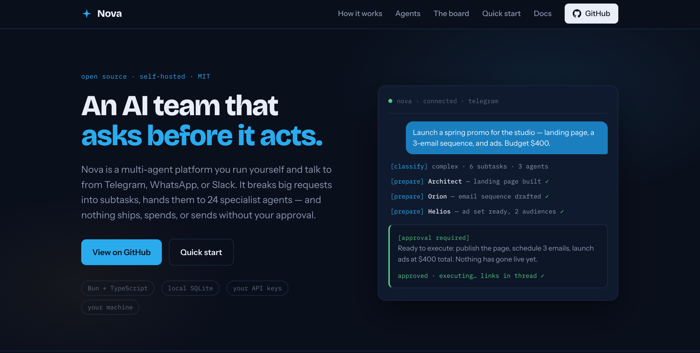

# Nova

**A self-hosted AI team that runs your operation — and asks before it acts.**

Nova is a self-hosted, open-source AI platform: a team of 24 specialist agents plus an
automation layer that reacts to events and runs the repeatable work in the background. You reach
it from Telegram, Slack, Discord, or a terminal — or a webhook, a metric, or a connector event
fires it — and it runs on your own model subscriptions and your own machine, with human approval
where it matters.

<p align="center">
  <a href="https://mynova.space">
    
  </a>
</p>

<p align="center">
  <a href="https://mynova.space"><b>Website</b></a>
  &nbsp;·&nbsp;
  <a href="https://mynova.space/docs/"><b>Documentation</b></a>
  &nbsp;·&nbsp;
  <a href="#quick-start"><b>Quick start</b></a>
  &nbsp;·&nbsp;
  <a href="LICENSE"><b>MIT license</b></a>
</p>

```
message ──▶ channel ──▶ relay ──▶ orchestrator ──▶ planner
  or        (Telegram/            │ classify         │ decompose into
 event       Slack/               │ (heuristic →     │ subtasks with
 (webhook,    Discord/            │  pattern cache → │ dependencies)
  metric,     terminal)          │  LLM)            │
  connector)                      ▼                  ▼
                            agent-router ◀── 24 specialist agents
                                  │
                          prepare ──▶ approve ──▶ execute
                          (safe)     (your gate)   (ships/spends/sends)
```

## What it is

- **Multi-agent, not a chatbot.** 24 specialist agents (marketing, ops, data, legal, and more —
  each just a markdown file). A message is classified cheaply, then answered directly, routed to
  one specialist, or decomposed into a dependency-ordered plan run across several. An optional
  distributed **executive board** (7 reasoning personas) can deliberate on strategic questions.
- **Event-driven, not just a chat bot.** A message is one trigger; a webhook, a metric crossing a
  threshold, a connector event, or a semantic match is another. Any of them can run an agent or a
  **playbook** (a reusable SOP), and **durable processes** carry multi-day work across waits and
  restarts. Nova runs the operation in the background, not only when you ask.
- **Two-phase execution + governance.** For interactive requests the safe half — research, drafts,
  generation — runs freely; then an inline **Approve / Revise / Cancel** gate; only after you
  approve does the consequential half — publish, send, spend — run. Autonomous paths (schedules,
  automations) are pre-authorized and governed by spending caps, role-based permissions, and
  content policies that can hard-block. Agents also earn autonomy over time (a per-category ladder).
- **Your models, your machine.** It drives the official vendor CLIs (Claude Code, Gemini, Codex)
  as subprocesses, so it runs on subscriptions you already pay for instead of metered API tokens —
  and it also supports any OpenAI-compatible API (OpenRouter, DeepSeek, xAI, local Ollama/vLLM).
  It does **not** reuse or extract tokens. Storage is local split SQLite; embeddings run locally
  (all-MiniLM-L6-v2, 384-dim). Your keys, your data. MIT licensed.

## What it does

**Core orchestration**
- 24 specialist agents + task decomposition with dependency resolution and parallel execution
- Two-phase approval gate + an earned-autonomy ladder (ask → notify → auto-within-caps)
- Persistent memory (facts, goals, tasks) with local semantic recall
- **Knowledge base (RAG)** — feed it PDFs, docs, and URLs; retrieved across agents with citations, on personal / team / per-agent scopes
- Multi-channel: Telegram (primary), Slack, Discord, terminal (`nova chat` / `nova connect`); WhatsApp per-user
- **Workboards** — ask for a board ("track my POs", "put new leads on a board") and Nova proposes fields and stages; agents fill and move cards, you drag them across stages in the dashboard, and a stage can optionally fire a playbook or agent task on entry, behind the same approval gate

**Business automation**
- **Playbooks** — reusable, versioned, parameterized SOPs
- **Automations** — an event (webhook, metric, connector, or semantic match) runs an agent or playbook, with dedupe, rate limits, retries, and a dead-letter queue
- **Durable processes** — multi-day flows that wait for a timer or event and resume, surviving restarts
- **Document extraction** — schema → strict, type-checked JSON from PDFs/DOCX
- **Connectors** — two-way Stripe, Shopify, Zendesk, HubSpot (read + write)
- **Connected data** — query HTTP JSON/CSV, read-only SQLite, or a connector read action
- **ROI reporting** — tasks automated, hours saved, and value vs. cost

**Governance & hardening**
- Compliance policies — spend caps, approval routing, and PII/content checks that can **hard-block** (prevent execution even after approval)
- Role-based permissions (capabilities) and out-of-office delegation
- Exactly-once idempotency, advisory locks (no double-fire), and AES-256-GCM encrypted secrets

**Foundations**
- 13 MCP servers (Notion, Google Workspace, Playwright, Cloudflare, ClickUp, GoHighLevel, Firecrawl, Tavily, Exa, and more) — called via **mcp2cli**, where agents discover tools on demand instead of loading every schema into context
- 45 skills (image/doc generation, research writing, and more) invoked by agents as needed
- Scheduler + proactive services (morning briefings, smart check-ins)
- Voice — inbound and outbound calls via Twilio; voice messages transcribed with Groq or local Whisper
- A unified `nova` CLI and a web dashboard

## How it works

Every incoming message is classified through three tiers, cheapest first:

1. **Heuristic** — short, simple messages skip straight to the model (no classifier LLM call).
2. **Pattern cache** — a request that matches a plan that worked before reuses it, skipping classification.
3. **LLM classification** — only genuinely new, complex asks pay for a cheap classify call (simple / routed / complex).

Complex requests are decomposed into subtasks with dependencies; independent branches run in
parallel, each on a specialist agent with its own tools and MCP access. Consequential actions run
in the **execute** phase, which waits for your approval (or runs under an earned autonomy grant with
a spending cap). Prepared artifacts — copy, images, files — flow from prepare into execute.

### Honest about the boundaries

Nova connects to real accounts and can spend real money, so it's worth being precise about what
protects you:

- **The approval gate is the default safety boundary — not a sandbox.** Sandboxed execution is
  **opt-in and off by default**: agent tools run unsandboxed on your host. A hardened Docker
  sandbox exists (`NOVA_SANDBOX_BACKEND=docker`) but is not the default, and if Docker isn't
  installed it **falls back to unsandboxed** with a warning. Run it as a dedicated user / on a VPS,
  and turn on the Docker sandbox if that matters to you.
- **"Asks before it acts" is about interactive requests.** Things you set up in advance to run on
  their own — scheduled tasks, automations, and durable-process steps — are **pre-authorized when
  you create them** and run without a fresh prompt each time (that's the point of automating). The
  controls on those autonomous paths are the earned-autonomy ladder with **spending caps** and the
  **hard-block** compliance policies (which stop execution even there).
- **It's young and solo-built.** ~390 unit tests across the suite, but no end-to-end tests of the
  full automation chain yet, and it's a broad surface for one maintainer. The connector set is a
  starter four. Read the code before you trust it with the keys.

On top of the approval gate, four controls are **on by default**: least-privilege agent env
(`NOVA_AGENT_ENV_STRICT`), an egress leak firewall that redacts/blocks secrets leaving the system
(`NOVA_LEAK_FIREWALL`), an untrusted-input firewall that neutralizes tool/web/email content before
it reaches an agent prompt (`NOVA_UNTRUSTED_FIREWALL`), and a dashboard that binds loopback-only
unless `DASHBOARD_PASS` is set. Run `nova doctor --security` to grade your deployment.

## Quick start

### Prerequisites

- **[Bun](https://bun.sh)** (`curl -fsSL https://bun.sh/install | bash`)
- The **[Claude Code](https://claude.ai/claude-code)** CLI installed and authenticated (or another supported provider)
- A **Telegram** account and a bot token from [@BotFather](https://t.me/BotFather)

### Option A: One-line install (recommended)

```bash
curl -fsSL https://mynova.space/install | bash
```

That clones Nova to `~/nova`, installs anything missing (Bun, the Claude Code CLI), and launches a
guided **setup wizard** (`nova init`) that connects Telegram and an AI provider — no file editing,
and it can auto-detect your Telegram user ID. The wizard is resumable.

> Prefer to clone yourself?
> `git clone https://github.com/djbelieny/nova.git && cd nova && bash bootstrap.sh` does the same.
> Just checking prerequisites? `bash bootstrap.sh --check` reports what's installed and changes nothing.

### Option B: Manual setup

```bash
git clone https://github.com/djbelieny/nova.git
cd nova
bun run setup          # install deps, create .env
# edit .env with your tokens/keys
bun run test:telegram  # verify bot token
bun run start          # start Nova
```

## The `nova` CLI

After setup, one `nova` command runs everything:

```bash
nova start                 # start the relay (main process)
nova chat                  # talk to Nova in your terminal
nova connect               # attach to a running Nova, with live activity + inline approvals
nova dashboard             # web dashboard
nova doctor                # health check
nova init                  # (re-)run the setup wizard

# capabilities
nova kb add <file|url>     # feed the knowledge base
nova playbook run <name>   # run a saved SOP
nova automation add …      # event → workflow
nova process | data | roi | extract   # processes, connected data, ROI, extraction

# governance
nova policy add …          # spend caps, approval routing, content checks
nova access grant …        # role-based capability grants
nova ooo set @teammate     # out-of-office delegation
nova connector set …       # store connector secrets, encrypted at rest
```

The underlying `bun run <script>` entry points still work; advanced scripts (`test:*`, `exec:*`)
are exposed through `bun run`.

## Project structure

```
src/
  relay.ts             # entry point — channels, coordination, service startup
  orchestrator.ts      # classification, two-phase gate, autonomy ladder, hard-block
  planner.ts           # task decomposition, parallel execution, artifacts
  agent-router.ts      # agent catalog, tool/skill/MCP mapping, prompt construction
  memory.ts            # intent tags, context injection
  db.ts                # split SQLite + sqlite-vec, encrypted credentials
  embeddings.ts        # local all-MiniLM-L6-v2
  ai-provider.ts / ai-router.ts / provider-registry.ts   # subscription CLIs + OpenAI-compatible
  knowledge.ts         # RAG knowledge base
  playbooks.ts automation-engine.ts process-engine.ts    # automation suite
  extraction.ts policy.ts roi.ts data-sources.ts
  connectors/          # Stripe, Shopify, Zendesk, HubSpot
  permissions.ts delegation.ts locks.ts                  # governance
  mcp2cli.ts sandbox/  # MCP-via-CLI, opt-in Docker sandbox
  channels/            # telegram, slack, discord, cli, whatsapp
  providers/           # claude, gemini, codex, groq
  cli.ts               # the unified `nova` command
services/              # task dispatcher, automation poller, proactive services
.claude/agents/        # 24 specialist agents (+ executives/) as markdown
.claude/skills/        # 45 skills
```

## Documentation

- **[mynova.space/docs](https://mynova.space/docs/)** — every feature, command, and configuration option
- **[SETUP.md](SETUP.md)** — guided setup walkthrough
- **[docs/ARCHITECTURE.md](docs/ARCHITECTURE.md)** — deep technical reference
- **[CLAUDE.md](CLAUDE.md)** — architecture & conventions
- **[SECURITY.md](SECURITY.md)** — reporting vulnerabilities · **[CONTRIBUTING.md](CONTRIBUTING.md)** — how to contribute

## License

MIT — take it, customize it, make it yours.

## Built with open source

Nova stands on a lot of other people's work. Each project below is used under its own license
(full license texts ship in `node_modules`); thank you to their maintainers.

**Runtime & AI**
- [Bun](https://bun.sh) — the runtime · [TypeScript](https://www.typescriptlang.org)
- [sqlite-vec](https://github.com/asg017/sqlite-vec) — vector search inside SQLite
- [Transformers.js](https://www.npmjs.com/package/@huggingface/transformers) — local embeddings, running the [all-MiniLM-L6-v2](https://huggingface.co/sentence-transformers/all-MiniLM-L6-v2) model
- [Model Context Protocol SDK](https://www.npmjs.com/package/@modelcontextprotocol/sdk) — MCP
- **mcp2cli** — the MCP-to-CLI bridge Nova drives so agents call MCP tools from the shell instead of loading every schema into context
- [RTK — Rust Token Killer](https://github.com/rtk-ai/rtk) (Apache-2.0) — installed by `bootstrap.sh` and **on by default**; compresses the output of common dev commands (git, build, test, grep…) by 60–90% before it re-enters an agent's context. Nova routes its own shell through it and it's safe by design (unknown commands pass through unchanged). Disable with `NOVA_RTK=off`.

**Channels & UI**
- [grammY](https://grammy.dev) (Telegram) · [Bolt](https://www.npmjs.com/package/@slack/bolt) (Slack) · [discord.js](https://discord.js.org) (Discord) · [Ink](https://www.npmjs.com/package/ink) + [React](https://react.dev) (terminal & dashboard)

**Documents & media**
- [pdf-parse](https://www.npmjs.com/package/pdf-parse) · [mammoth](https://www.npmjs.com/package/mammoth) · [docx](https://www.npmjs.com/package/docx) · [PptxGenJS](https://www.npmjs.com/package/pptxgenjs) · [sharp](https://sharp.pixelplumbing.com) · [Playwright](https://playwright.dev)

**Other**
- [groq-sdk](https://www.npmjs.com/package/groq-sdk) (transcription) · [Resend](https://resend.com) (email) · [dotenv](https://www.npmjs.com/package/dotenv)

Nova **runs on** the official vendor CLIs — [Claude Code](https://claude.ai/claude-code), the Gemini
CLI, and Codex — driven as subprocesses under your own subscriptions. Those are proprietary tools,
not bundled with Nova.

And it grew out of Goda's minimal [Claude Code Telegram Relay](https://github.com/godagoo) pattern —
the original "run Claude Code as an always-on Telegram bot" idea — since almost entirely rewritten
into the platform you see here.

---

Built by [Jake Belieny](https://jakebelieny.com)
